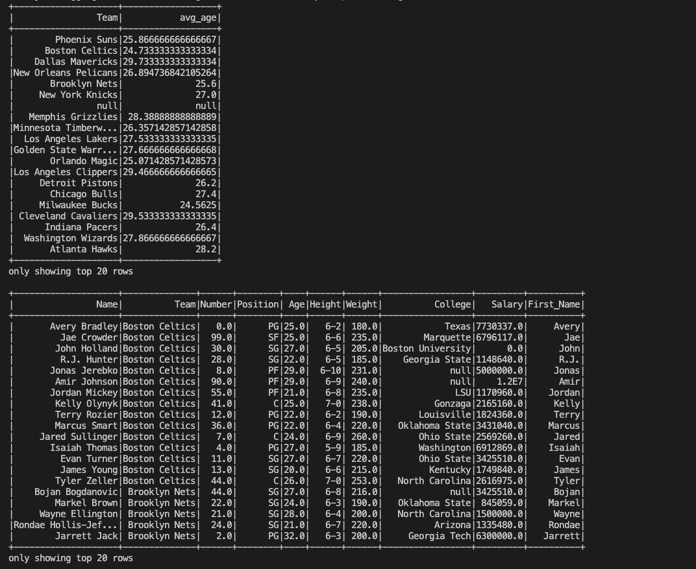

# PySpark Data Processing

## Description
This project use PySpark to perform data processing on a large dataset nba.csv, with Name,Team,Number,Position,Age,Height,Weight,College,Salary. It firstly replace missing salary values with 0 and then query average age of players by team and then Extract the player's first name from the "Name" column for data transformation.

## Sample Output

