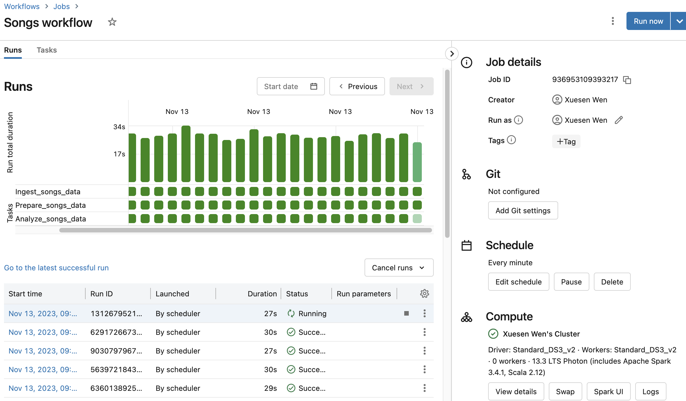

# Data Pipeline with Databricks

## Description
The dataset used in this example is a subset of the Million Song Dataset, a collection of features and metadata for contemporary music tracks. This dataset is available in the sample datasets included in your Databricks workspace. Then transform the raw songs data by filtering out unneeded columns and adding a new field containing a timestamp for the creation of the new record. Lastly query the transformed data: 1.Which artists released the most songs each year? 2.Find songs for your DJ list. The pipe line is scheduled every minute.

## Sample Output

