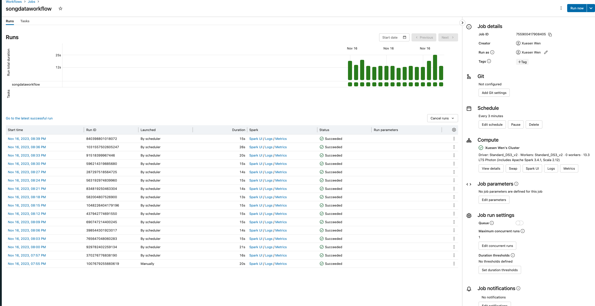

# Individual Project #3: Databricks ETL (Extract Transform Load) Pipeline

## Description
The dataset used in this example is a subset of the Million Song Dataset, a collection of features and metadata for contemporary music tracks.

[Video Walkthrough](https://youtu.be/tm43OoNuykE)

Firstly, ingest the raw data by explicitly defineing the schema. 

Secondly, transform data using Spark SQL to get the the artist_id with the count of songs they have in the original dataset in descending order. 
Thridly, Store the transformed Data in Delta Lake. 
Forthly, check if the transfored data is not empty. if empty, raise an error.
 
Fifth, visualize the transformed data for the first 100 record.

Lastly, schedule the pipe line every 3 minutes for demo purpose.

### Unique Capabilities of Delta Lake
#### Time Travel
Delta Lake provides time travel functionality, allowing users to query the history of the data. This is particularly useful for auditing, debugging, and recovering from errors. This project's pipeline takes advantage of time travel to track changes made to the dataset over time, enabling easy rollback to a specific version if necessary.
#### Metadata Management
Delta Lake maintains rich metadata, which includes information about the schema of the table, data statistics, and data lineage. This metadata is valuable for understanding the dataset's evolution and making informed decisions about data transformations. This pipeline leverages metadata management to gain insights into the dataset's structure and characteristics.
#### ACID Transactions
Delta Lake supports ACID (Atomicity, Consistency, Isolation, Durability) transactions, ensuring data integrity and consistency. The pipeline relies on ACID transactions to guarantee that each operation on the dataset is atomic and that the data is always in a consistent state. This is crucial for maintaining the quality and reliability of the dataset, especially when working with others.

### Data Validation Checks
The notebook incorporates data validation checks using Delta Lake to enhance the overall data quality. These checks are performed before the data analysis phase and focus on identifying incomplete rows and inconsistent schemas.

#### Missing Data 
This project's data pipeline checks for incomplete rows to identify and handle missing or null values in the dataset. By leveraging Delta Lake's capabilities, the pipeline can efficiently identify and address incomplete rows, ensuring that the data used for analysis is complete and accurate.

